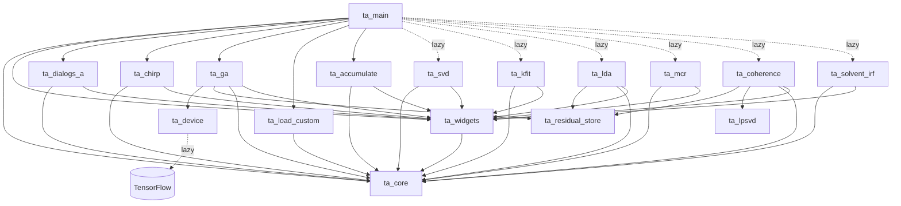
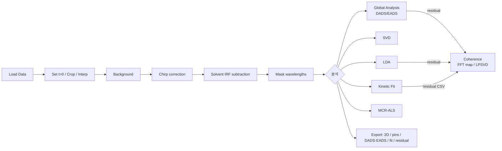

# TA Analyzer (rev5) — 아키텍처 문서

Transient Absorption(TA) 측정 데이터 분석 프로그램의 전체 로직과 모듈 구조를 정리한 문서입니다.
`README.md`와 실제 소스 코드(`ta_*.py`, 약 15,500줄)를 기준으로 작성했습니다 (2026-09-28 기준).

> MATLAB `TRSpecAnalyzer.m`(8,326줄)을 Python/PyQt5로 옮긴 프로그램입니다.
> 스택: **PyQt5**(GUI) + **matplotlib Qt5Agg**(플롯) + **NumPy/SciPy**(수치 계산) + 선택 사항으로 **openpyxl**(xlsx), **TensorFlow**(GA의 GPU 가속).

---

## 1. 한눈에 보기

```
┌───────────────────────────────────────────────────────────────────────┐
│                         ta_main.TAAnalyzer                            │
│     (QMainWindow — 앱 상태를 모두 들고 있음 + 보정 파이프라인 + 3개 패널) │
│                                                                       │
│   toolbar ──► 로딩 / 보정 / 분석 다이얼로그를 여는 버튼                 │
│   panels  ──► 2D map · Spectrum(λ) · Kinetics(t)                      │
└──────┬──────────────────────────┬──────────────────────────┬──────────┘
       │ 다이얼로그가 app을 참조      │ 다이얼로그가 app 상태를 읽고 씀  │
       ▼                          ▼                          ▼
  Loading dialogs           Correction dialogs          Analysis dialogs
  ta_accumulate             ta_dialogs_a (BG/Crop/Mask) ta_ga, ta_svd, ta_kfit
  ta_load_custom            ta_chirp                    ta_lda, ta_mcr
  ta_dialogs_a.LoadAverage  ta_solvent_irf              ta_coherence(+ta_lpsvd)
       │                          │                          │
       └──────────────┬───────────┴──────────────┬───────────┘
                      ▼                          ▼
               ta_core (GUI 의존성 없는     ta_residual_store (residual xlsx 저장/로드)
               수치 커널 + 파일 I/O)        ta_device (TF CPU/GPU backend, GPU 제어)
                      ▲
               ta_widgets (MplCanvas, 입력 위젯, 메시지 박스, heatmap 헬퍼)
```

### 설계 원칙 요약

| 원칙 | 구현 |
|---|---|
| **상태는 한 곳에** | 데이터, 보정 파라미터, GA 결과 등 앱 상태는 모두 `TAAnalyzer` 인스턴스 속성으로 둡니다. 다이얼로그는 `app` 참조를 받아 이 상태를 직접 읽고 씁니다. |
| **비파괴 보정** | `deltaA_raw`는 그대로 두고, `recompute()`가 매번 raw → BG → chirp → solvent → mask를 다시 적용해 `deltaA`를 만듭니다. |
| **원본 스냅샷** | `original_*`는 로딩 직후 상태로 고정됩니다. Crop과 Revert는 항상 이 원본에서 다시 잘라냅니다. |
| **GUI와 수치 분리** | 수치 계산은 `ta_core`, `ta_lpsvd`에 두고 Qt import를 하지 않습니다. 그래서 테스트에서 GUI 없이 바로 호출할 수 있습니다. |
| **다이얼로그 단일 인스턴스** | `_open_dialog()`는 이미 열린 창이 있으면 앞으로 가져오고, 닫히면 `*_fig` 참조를 `None`으로 되돌립니다. |
| **지연 import** | SVD, Kfit, LDA, MCR, Coherence, Solvent-IRF 다이얼로그는 버튼을 누를 때 import합니다. TensorFlow도 GA 창에서 처음 필요할 때 import합니다. 시작 속도를 위한 선택입니다. |

---

## 2. 모듈 구성

### 2.1 계층별 분류

| 계층 | 모듈 | 줄 수 | 역할 |
|---|---|---:|---|
| **Entry / Shell** | `ta_main.py` | 3,185 | `TAAnalyzer` 메인 윈도우: 상태 초기화, UI 구성, 보정 파이프라인, 패널 3개 렌더링, crop/interp/zero-shift, export, 다이얼로그 열기. `main()` 진입점 |
| **Numerical core** | `ta_core.py` | 2,016 | 파일 파싱/쓰기, colormap, chirp 모델·피팅·ridge, solvent 정렬, 결측 보간, λ축 resampling(`resample_wavelength`, `apply_bin_groups`), IRF 컨볼루션, GA(VARPRO), EADS, stretched-exp, single-trace fit, LDA/L-curve, MCR-ALS, coherence FFT |
| | `ta_lpsvd.py` | 525 | LPSVD(Lorentzian)와 Gaussian 감쇠 진동자 모드 분해 (1D 시계열) |
| **Infra / Service** | `ta_residual_store.py` | 369 | GA/LDA residual을 `residuals/*.xlsx`로 저장하고, 목록 조회·로드 (CSV도 로드 가능) |
| | `ta_device.py` | 725 | TensorFlow 장치 목록, `TFBackend`(lstsq/matmul), GPU 상태(pynvml/nvidia-smi), 팬 제어, keep-warm 스레드, 관리자 권한 재실행 |
| | `ta_widgets.py` | 179 | `MplCanvas`(+toolbar), `make_*_edit`, `info_box`/`warn_box`, 파일 다이얼로그, `draw_heatmap`, `compute_zlim` |
| **Loading dialogs** | `ta_accumulate.py` | 589 | `LoadDataChooserDialog`(Standard/Custom/Accumulation 선택), `AccumulationDialog`(폴더 안 반복 측정 파일을 미리 보고 체크한 것만 평균) |
| | `ta_load_custom.py` | 777 | `CustomLoadDialog`: 스프레드시트형 미리보기에서 X(λ), Y(t), Z(ΔA) 영역을 드래그로 지정. 자동 전치, 자동 감지 기능 포함 |
| | `ta_dialogs_a.py` → `LoadAverageDialog` | | 여러 파일을 선택했을 때 평균을 내고 저장 또는 로드 |
| **Correction dialogs** | `ta_dialogs_a.py` | 1,736 | `BackgroundDialog`, `CropDialog`(λ/t 범위, λ축 resampling, delay/λ drop 뒤 보간), `MaskDialog` |
| | `ta_chirp.py` | 446 | `ChirpDialog`: 클릭 또는 ridge 자동 배치로 점을 찍고, 4-파라미터 Sellmeier 피팅 |
| | `ta_solvent_irf.py` | 542 | `SolventIRFDialog`: 순수 용매 측정을 로드해 정렬하고, scale 조절(자동 추정 포함) 후 빼기 |
| **Analysis dialogs** | `ta_ga.py` | 1,888 | `GlobalAnalysisDialog`: multi-exp(+stretched) ⊗ Gaussian IRF 글로벌 피팅, DADS/EADS, 장치 선택, Stop |
| | `ta_svd.py` | 419 | `SVDDialog`: σ 스펙트럼, U/V 벡터, rank-N 재구성과 residual |
| | `ta_kfit.py` | 523 | `KineticFitDialog`: 단일 λ(또는 λ 창 평균) trace 피팅 |
| | `ta_lda.py` | 471 | `LDADialog`: Tikhonov 정규화 lifetime density, L-curve |
| | `ta_mcr.py` | 355 | `MCRDialog`: MCR-ALS (non-negativity, unimodality) |
| | `ta_coherence.py` | 1,079 | `CoherenceDialog`: 탭 ① residual의 2D \|FFT\|² 맵, 탭 ② LPSVD/Gaussian 모드 분해 |
| **Build / Docs** | `ta_analyzer.spec` | | PyInstaller one-file windowed 빌드 → `dist/TA_Analyzer.exe` |
| | `manual/` | | 한/영 Quick, Detailed 매뉴얼(md/pdf)과 `build_manual_pdf.py` |
| **Tests** | `test/test_*.py` | | 통합, 실제 파일, 수치 커널, 다이얼로그, crop/interp, residual store, LPSVD 등 약 23개 테스트 파일과 테스트 데이터 폴더 |

### 2.2 Import 의존 그래프



순환 import는 없습니다. 다이얼로그 → `ta_main` 방향의 import도 없습니다. 다이얼로그는 생성자에서 받은 `app` 객체를 통해서만 메인 윈도우와 통신합니다.

---

## 3. 데이터 모델 (`TAAnalyzer` 상태)

모든 ΔA 행렬의 shape 규약은 **(M wavelengths) × (N delays)** 입니다. 단, `compute_mcr`만 내부적으로 (Nt, Nwl)을 씁니다.

| 그룹 | 주요 속성 | 설명 |
|---|---|---|
| 원본 스냅샷 | `original_wavelength`, `original_delay`, `original_deltaA` | 로딩 직후 상태로 고정. Crop과 Revert의 기준 |
| 작업 데이터 | `wavelength`, `delay`, `deltaA_raw` | crop이나 보간이 반영된 "raw". 보정 전 값 |
| 표시/분석 데이터 | `deltaA` | `recompute()`가 만든 보정된 행렬. **모든 분석 다이얼로그의 입력** |
| Background | `bg_applied`, `bg_spectrum (M,)`, `bg_n` | 앞쪽 N개 delay(pre-trigger)의 평균 스펙트럼 |
| Chirp | `chirp_applied`, `chirp_pts (K×2)`, `chirp_params [a,b,c,d]`, `chirp_fit_rms`, `ridge_*` | t₀(λ) = a·√((bλ²−1)/(cλ²−1)) + d |
| Solvent IRF | `sub_irf_applied`, `sub_irf_scale`, `sub_irf_solv_{wl,t,data}`, `sub_irf_aligned` | 용매 원본(자기 grid 기준)과 샘플 grid에 정렬한 캐시 |
| Mask | `masked_regions: [(wl1, wl2, 'nan'|'zero')]` | |
| Zero-time | `tZeroShift` | 누적된 delay 축 이동량 |
| Crop / Resample (v1.1.0) | `crop_bounds`, `resample_enabled`, `resample_dx`, `resample_mode`, `resample_info`, `_crop_wl_pre_resample` | 요청한 crop 범위(원본 시간축 기준, 전체면 None)와 λ축 resampling 설정. `resample_info`는 bin 묶음(average: `starts`, decimate: `idx`), `_crop_wl_pre_resample`는 resampling 직전의 crop된 λ축 |
| Selection | `selWL`, `selT`, `_selT_idx` | 크로스헤어 위치. delay는 측정된 점으로만 이동(index 기반) |
| Overlays | `specOverlays`(t 목록), `kinOverlays`(λ 목록) | Pin 기능 |
| 표시 설정 | `delay_scale_mode`(linear/log/split), `split_threshold`, `main_view_t{min,max}`, `map_colormap`, `map_z_{min,max}`, `time_unit`(ps/us) | |
| GA 설정 | `ga_n_comp`, `ga_tau_init/fixed`, `ga_beta_init/fixed`, `ga_stretch_on`, `ga_has_inf`, `ga_t0(_fixed)`, `ga_fwhm(_fixed)`, `ga_irf_mode`, `ga_t_{min,max}` | 다이얼로그를 다시 열어도 유지됨 |
| GA 결과 | `ga_result_{tau,beta,t0,fwhm,dads,eads,fit,rms,delay,data,t_window,...}` | `delay`/`data`는 fit window로 자른 축 |
| 기타 결과 캐시 | `_last_lda` | Coherence의 "LDA residual" 소스로 사용 |
| 렌더링 캐시 | `_map_images`, `_*_layout_sig`, `_spec_xlim`, `_kin_xlims`, `_*_auto_x/y` … | 부분 갱신과 zoom 상태 보존용 |
| 자식 창 | `bg_fig`, `chirp_fig`, `crop_fig`, `load_fig`, `accum_fig`, `ga_fig`, `mask_fig`, `svd_fig`, `kfit_fig`, `lda_fig`, `mcr_fig`, `coh_fig`, `sub_irf_fig` | 단일 인스턴스 관리 |

---

## 4. 핵심 처리 흐름

### 4.1 전체 워크플로 (사용자 관점)



### 4.2 데이터 로딩

```
Toolbar "Load Data..." → LoadDataChooserDialog
 ├─ standard     → 파일 선택
 │                 ├─ 1개  → ta_core.parse_data_file → set_loaded_data
 │                 └─ 여러 개 → LoadAverageDialog (체크, 평균, 저장/로드) → set_loaded_data
 ├─ custom       → CustomLoadDialog (X/Y/Z 영역 선택, 필요하면 전치) → set_loaded_data
 └─ accumulation → AccumulationDialog (폴더 스캔, 2D 미리보기, 체크한 파일 평균) → set_loaded_data
```

**`parse_data_file`** 은 구분자(`,` / tab / 공백)와 두 가지 레이아웃을 자동으로 판별합니다.
- **Format A (MATLAB)**: 첫 행 = `[corner, t1..tN]`, 첫 열 = `λ1..λM`
- **Format B**: 앞 2열이 메타데이터. `row[0][2:]` = t, `row[i][1]` = λ
- `numpy.genfromtxt` 기반. 축 값이 숫자가 아닌 행이나 열은 버리고, 행렬 안의 비숫자 셀은 NaN으로 바꿉니다. λ와 t는 오름차순으로 정렬합니다.

**`set_loaded_data(wl, t, A, desc, source_dir)`** 은 로딩 경로 세 가지가 모두 거치는 함수입니다.
1. `original_*`와 작업 사본(`wavelength`, `delay`, `deltaA_raw`, `deltaA`)을 만듭니다.
2. 모든 보정 상태를 초기화합니다: BG, chirp, ridge, solvent, tZeroShift, mask, overlay, GA 결과, 패널 zoom.
3. 기본 선택값을 정합니다: λ는 가운데 값, t는 처음으로 0 이상인 delay. 표시 범위와 Z 범위도 자동으로 잡습니다.
4. `update_all()`을 호출합니다.

`data_source_dir`은 이후 모든 저장 다이얼로그의 기본 폴더가 됩니다(`default_save_path`).

### 4.3 보정 파이프라인 — `update_all()` → `realign_solvent()` → `recompute()` → 패널 3개 다시 그리기

```
deltaA_raw (M×N)
   │  − bg_spectrum[:,None]                       (bg_applied)
   ▼
   │  apply_chirp_shift(row i를 t + t0(λ_i)에서 샘플링; 범위 밖은 NaN)   (chirp_applied)
   ▼
   │  apply_solvent_subtraction(data − s · sub_irf_aligned)            (sub_irf_applied, shape 일치)
   ▼
   │  masked_regions → 해당 λ 행을 NaN 또는 0으로
   ▼
deltaA  ──► 2D map / Spectrum / Kinetics / 모든 분석
```

- **순서가 중요합니다.** Solvent 빼기는 chirp 보정 **뒤에** 합니다. `realign_solvent()`는 용매 행렬을 샘플 (λ, t) grid로 리샘플링(`align_solvent_to_sample`)한 뒤 **같은 chirp 파라미터로 용매도 시프트**합니다. 그래야 두 행렬의 IRF가 모두 t≈0에 놓입니다. BG는 용매에 적용하지 않습니다. BG는 샘플 pre-trigger에서 구한 값이기 때문입니다.
- 각 보정 다이얼로그는 `app`의 플래그와 파라미터만 바꾸고 `app.update_all()`을 호출합니다. 예: `BackgroundDialog.apply_bg`는 `bg_spectrum = nanmean(deltaA_raw[:, :N])`, `bg_applied = True`로 설정합니다.
- `get_chirp_base_data()`는 BG만 적용된 데이터를 돌려줍니다. Chirp 다이얼로그가 이 데이터를 배경 맵으로 씁니다.

### 4.4 축을 바꾸는 연산 (grid mutation)

| 연산 | 동작 | 초기화되는 것 |
|---|---|---|
| `apply_crop_by_range(..., resample=)` | 범위를 먼저 검증(빈 범위면 상태 변경 없이 경고)한 뒤 `crop_bounds`를 저장하고, `_rebuild_working_grid()`가 `original_*`에서 λ/t 마스크로 잘라낸 다음 선택적으로 λ축을 `ta_core.resample_wavelength`로 줄여 `deltaA_raw`를 만듦. `resample` 키워드 없이 호출하면(Revert 등) resampling 해제 | BG, chirp, ridge, solvent 정렬, tZeroShift, mask, GA 결과, zoom. overlay와 선택값은 새 범위로 clip |
| `CropDialog._apply` + drop | drop한 delay/λ를 `interpolate_missing_{columns,rows,2d}`(linear/cubic/pchip/akima/bilinear)로 보간. crop 범위가 바뀌면 원본 전체를 보간한 뒤 crop하고 `original_deltaA`는 되돌림. 범위와 resample 설정이 그대로이고 resampling이 꺼져 있으면 `interpolate_*_at`으로 `deltaA_raw`만 수정. resampling이 켜져 있으면 항상 원본부터 재구성 | GA 결과 |
| `CropDialog` resample 설정 | 균일 bin `[λ_min + kΔλ, λ_min + (k+1)Δλ)`. Average = bin 평균(λ, ΔA nanmean), Decimate = bin 중심에 가장 가까운 원본 행. 빈 bin 제외. Δλ ≤ 평균 간격이면 경고 후 crop만 적용. 스핀박스 6자리 반올림 오차는 현재 요청/전체 경계로 snap(`_snap_bounds`) | Crop과 같음 |
| `apply_zero_time_shift` / "Set t=0 here" | `delay -= δ`, `tZeroShift += δ` | kinetics zoom |
| `reset_corrections` | 보정 플래그를 모두 끄고 tZeroShift를 되돌림 (로드한 용매는 메모리에 유지) | 패널 zoom |

### 4.5 렌더링 (메인 윈도우)

- **패널 3개**: 2D map(`_draw_map_2d`), Spectrum at `selT`(`_draw_spectrum`), Kinetics at `selWL`(`_draw_kinetics`).
- **Layout signature 기반 부분 갱신**: 각 패널마다 `_compute_*_layout_sig()`로 축 크기, scale mode, overlay 수 같은 값을 모아 서명을 만듭니다. 서명이 **같으면** `set_array`/`set_ydata`/`set_clim`으로 artist만 갱신하고(`_update_*_in_place`), **다르면** figure를 새로 만듭니다(`_draw_*_full`). colorbar가 계속 쌓이는 문제도 이 방식으로 막습니다.
- **Delay 축 모드**: linear, log, split(threshold 기준으로 좌우 두 축). split 모드에서는 kinetics도 두 패널이 되므로 zoom과 auto 플래그를 `[0, 1]` 인덱스별로 따로 관리합니다.
- **Zoom 보존**: 사용자가 pan/zoom한 xlim/ylim을 저장해 두고, crosshair가 바뀌어 다시 그릴 때 복원합니다. 프로그램이 직접 set_xlim을 호출할 때는 `_suppress_zoom_save`로 저장을 막습니다. Toolbar의 Home 버튼을 누르면 캐시를 지웁니다.
- **우클릭 메뉴**: 패널마다 Auto scale X/Y 토글과 Set X/Y range를 제공합니다(`_RightClickMenuFilter`, `_show_panel_menu`).
- **상호작용**: 2D map을 클릭하면 `set_sel_wl`/`set_sel_t`로 가장 가까운 측정점에 맞춥니다. Pin 버튼은 overlay 목록에 추가하고, Export pins는 CSV로 저장합니다.

---

## 5. 분석 모듈 상세

모든 분석 다이얼로그는 기본적으로 `app.deltaA`, `app.wavelength`, `app.delay`를 입력으로 씁니다. 공통 UI 흐름은 **Setup 입력 → Run(→ `ta_core` 커널) → 결과 플롯 → Export**입니다. 긴 계산 중에는 `QApplication.processEvents()`로 UI가 멈추지 않게 합니다. 별도의 QThread는 쓰지 않습니다.

### 5.1 Global Analysis (`ta_ga.py` → `ta_core.fit_global_analysis`)

- **모델**: D(λ,t) ≈ Σⱼ Aⱼ(λ) · Cⱼ(t)
  - Cⱼ = exp(−(t−t₀)/τⱼ) ⊗ Gaussian IRF(FWHM). 닫힌 형태를 `erfcx`로 구간별로 계산해 overflow를 피합니다(`exp_irf_conv`).
  - 선택: **stretched** Cⱼ = exp(−((t−t₀)/τⱼ)^βⱼ) ⊗ IRF. 수치 컨볼루션을 하거나(`irf_mode='numerical'`), IRF 없이 t₀ 근처를 마스킹합니다(`'skip'`).
  - 선택: τ=∞ offset 성분(step response).
- **VARPRO**: 비선형 파라미터(log τ, log β, t₀, log FWHM)는 `least_squares(method='trf')`로 최적화합니다. 기본값이며 `'nm'`을 고르면 Nelder-Mead를 씁니다. 진폭 A는 매 반복마다 선형 최소제곱(`lstsq`)으로 바로 풉니다. Fixed 플래그로 파라미터를 고정할 수 있습니다.
- **Fit window**: `ga_t_min`~`ga_t_max`로 delay를 잘라 피팅합니다. 필요한 최소 점 수는 3 + N_τ (+1)입니다. 결과는 잘린 축(`ga_result_delay`) 기준으로 저장합니다.
- **출력**: τ, β, t₀, FWHM, RMS, **DADS**(= A), **EADS**(`compute_eads_from_dads`, 순차 모델), fit 맵, residual 맵, 클릭한 λ의 kinetics.
- **장치 가속** (`ta_device`): TensorFlow가 있으면 CPU/GPU 목록을 보여 줍니다. `TFBackend.lstsq/matmul`로 핫 커널을 해당 장치에서 실행합니다. GPU 상태(온도, 사용률, 팬)는 1 Hz로 갱신하고, 팬 속도 강제와 keep-warm 스레드, 관리자 권한 재실행 기능이 있습니다. TF가 없으면 NumPy로 동작합니다.
- **Stop**: `stop_check` 콜백을 objective에서 확인하고, 중단되면 `GlobalAnalysisStopped` 예외를 던집니다.
- **Save residual**: `ta_residual_store.save_residual_2d('GA', ...)` → `residuals/GA_<dataset>_<ts>.xlsx`.

### 5.2 SVD (`ta_svd.py`)
NaN을 0으로 바꾼 뒤 `np.linalg.svd`를 계산합니다. σ 스펙트럼(log), U(λ)/V(t) 앞쪽 k개, rank-N 재구성과 residual 맵을 보여 줍니다. U/S/V와 재구성 결과를 CSV/xlsx로 내보냅니다.

### 5.3 Kinetic Fit (`ta_kfit.py` → `fit_single_trace`)
단일 λ 또는 λ 창 평균 trace를 multi-exp(+stretched β) ⊗ IRF로 피팅합니다. 결과로 trace, 파라미터, residual CSV(`kfit_<λ>nm_residual.csv`, Coherence에서 불러올 수 있음)를 저장합니다.

### 5.4 LDA (`ta_lda.py` → `compute_lda`, `compute_lcurve`)
log 간격의 고정 τ grid 위에서 Tikhonov 정규화(`l2` 또는 `l2deriv`) 선형 역문제를 풉니다. 출력은 A(λ, τ) lifetime density 맵과 재구성 결과입니다. L-curve로 α를 고르는 것을 도와줍니다. 결과는 `app._last_lda`에 캐시하고, residual은 `save_residual_2d('LDA')`로 저장합니다.

### 5.5 MCR-ALS (`ta_mcr.py` → `compute_mcr`)
D ≈ C·Sᵀ로 분해합니다. 초기값은 SVD, random, custom 중에서 고르고, C/S에 non-negativity 제약, C에 unimodality 제약을 걸 수 있습니다. LOF(%)로 수렴을 판정합니다. C, S, 재구성 결과를 내보냅니다.

### 5.6 Coherence (`ta_coherence.py`)
**Residual 소스** (`_build_residual`): ① raw ΔA ② GA residual(fit window 밖은 0으로 채움) ③ LDA residual ④ **파일**(`residuals/` 목록 또는 Browse로 xlsx/csv, 1D/2D 모두 가능).
- **FFT 탭** → `ta_core.compute_coherence`: 시간 창 선택, 균일 grid로 리샘플링, detrend(none/mean/linear), apodization(rect/hann/hamming/blackman), zero-pad를 거쳐 행마다 \|FFT\|²을 계산합니다. 주파수 단위는 cm⁻¹/THz/Hz, 정규화는 peak/none/perWl 중에서 고릅니다.
- **LPSVD 탭** → `ta_lpsvd.run_lpsvd_analysis`: λ 평균 또는 λ 슬라이스로 1D trace를 만들고, 전처리 후 **Lorentzian**(Hankel SVD LPSVD) 또는 **Gaussian**(FFT 피크를 초기값으로 한 `curve_fit`) 모드로 분해합니다. 모드 재구성, 신뢰도 평가, 결과와 메타데이터 export를 제공합니다.

### 5.7 Residual 파이프라인 (분석 간 연결)

```mermaid
flowchart LR
    GA[Global Analysis] -- save_residual_2d --> S[(residuals/*.xlsx<br/>Residual2D + Meta)]
    LDA -- save_residual_2d --> S
    KF[Kinetic Fit] -- CSV 저장 --> F[(kfit_*_residual.csv)]
    GA -. in-memory ga_result_fit .-> COH[Coherence]
    LDA -. in-memory app._last_lda .-> COH
    S -- list_residual_files / load_residual --> COH
    F -- Browse --> COH
```

xlsx 형식: `Residual2D` 시트(첫 행 = t, 첫 열 = λ) 또는 `Residual1D` 시트(A = t, B = r), 그리고 `Meta` 시트(analysis, dataset, λ, time_unit, timestamp, rms, t_window …).

---

## 6. 다이얼로그와 메인 윈도우의 통신 규약

```python
# ta_main.TAAnalyzer
def _open_dialog(self, DialogClass, attr_name, *args):
    # 이미 열려 있으면 raise_(), 없으면 DialogClass(self, self, *args) 생성
    # finished 시그널에서 setattr(self, attr_name, None)
```

| 방향 | 방식 | 예 |
|---|---|---|
| Dialog → App (상태) | `app.<attr> = …` 직접 대입 | `app.chirp_params = pp`, `app.ga_result_* = …`, `app.sub_irf_scale = s` |
| Dialog → App (동작) | 공개 메서드 호출 | `app.update_all()`, `app.set_loaded_data()`, `app.apply_crop_by_range()`, `app.interpolate_*_at()`, `app.realign_solvent()`, `app.recompute()` |
| Dialog → App (유틸) | 헬퍼 호출 | `app.default_save_path(name)`, `app.t_unit_txt()/t_unit_ax()/t_unit_hdr()` |
| App → Dialog | 거의 없음. 다이얼로그를 열 때 app 상태를 읽고, 닫을 때 `app.<x>_fig = None` | |

> 결합도: 다이얼로그가 `TAAnalyzer`의 속성 이름을 직접 알고 있어서 결합이 강합니다(shared mutable state). 대신 구조가 단순하고 MATLAB handle class 구조와 1:1로 대응합니다. 속성 이름을 바꿀 때는 `ta_*.py` 전체를 grep해야 합니다.

---

## 7. 상태 무효화 규칙 (중요)

| 트리거 | BG | Chirp | Solvent | Mask | t₀ shift | GA 결과 | Overlay | Zoom |
|---|:-:|:-:|:-:|:-:|:-:|:-:|:-:|:-:|
| 새 데이터 로드 | 초기화 | 초기화 | **데이터까지 삭제** | 초기화 | 초기화 | 초기화 | 초기화 | 초기화 |
| Crop / Resample | 초기화 | 초기화 | 끄고 다시 정렬(원본 용매는 유지) | 초기화 | 초기화 | 초기화 | 범위로 clip | 초기화 |
| Drop 보간 | 유지 | 유지 | 유지 | 유지 | 유지 | 초기화 | 유지 | 유지 |
| Reset Corrections | 끔 | 끔 | 끔(데이터 유지) | 초기화 | 되돌림 | 유지 | 유지 | 초기화 |
| Set t=0 | 유지 | 유지 | 다시 정렬 | 유지 | 누적 | 유지 | 유지 | kinetics만 초기화 |

`is_cropped()`는 resampling 직전 grid의 길이로 판정합니다. 전체 범위에서 resampling만 한 경우는 cropped가 아닙니다. Revert 버튼은 `is_modified()` = `is_cropped() or resample_enabled`를 따릅니다.

Solvent IRF: resampling이 켜져 있으면 `realign_solvent()`가 원본 용매를 `_crop_wl_pre_resample` grid에 정렬하고, 샘플이 쓴 bin 묶음을 `apply_bin_groups`로 그대로 적용한 뒤 chirp를 적용합니다.

---

## 8. 파일 I/O

| 기능 | 함수 | 형식 |
|---|---|---|
| 로드 | `ta_core.parse_data_file` | CSV/TSV/DAT/TXT (Format A/B 자동 판별) |
| 2D export | `write_data_file` / `write_data_excel` | Format A 레이아웃(다시 로드 가능), CSV/TSV/xlsx |
| Export 2D (현재 / original) | `TAAnalyzer.export_2d_data`, `export_2d_data_original` | 보정 후 `deltaA` / 로딩 원본 |
| Pins export | `export_spec_overlays`, `export_kin_overlays` | CSV (`_pinned_spectra.csv`, `_pinned_kinetics.csv`) |
| Chirp points | `ChirpDialog.save_pts/load_pts` | `chirp_points*.csv` |
| GA 결과 | `export_dads/eads/matrix_2d/kinetics` | CSV (`_DADS`, `_EADS`, `_GA_fit`, `_GA_residual`, `_kinetics_<λ>nm`) |
| Residual | `ta_residual_store` | xlsx (Residual2D/1D + Meta), CSV 로드 지원 |

입력 데이터 폴더 구조 (측정 장비 출력):
`_TA_spectra_Accumulated.csv`, `_TA_spectra_Current_Set_{n}.csv`, `_Probe_spectra_Pump_{ON,OFF}_*.csv`. Accumulation 로더는 폴더 안의 `Current_Set_*` 파일을 골라 평균하는 용도입니다.

---

## 9. 빌드, 배포, 테스트

- **실행**: `python ta_main.py`
- **의존성**: `PyQt5 numpy scipy matplotlib` (+ `openpyxl` xlsx용, + 선택 사항 `tensorflow==2.10.x`, `pynvml`)
- **빌드**: `python -m PyInstaller ta_analyzer.spec --noconfirm --clean` → `dist/TA_Analyzer.exe` (one-file, console 없음, UPX 끔). 지연 import되는 `ta_*` 모듈은 모두 `hiddenimports`에 명시합니다. TensorFlow, pandas, tkinter 등은 exclude합니다.
- **테스트**: `test/test_*.py`. 주로 GUI 없이 `ta_core` 커널을 합성 데이터로 검증하고, 일부는 다이얼로그를 띄워 통합 테스트합니다. 테스트 데이터 폴더(`IRF_2nd`, `_5_2nd` 등)가 함께 있습니다.

---

## 10. 알려진 코드 이슈

- `ta_core.fit_global_analysis` docstring 첫 줄은 "Nelder-Mead"라고 되어 있지만, 실제 기본 최적화기는 TRF(`least_squares`)입니다 (`method='nm'`은 legacy 선택지).
- `test_new_features` [4.SpecZoom]가 실패합니다 (2026-09-28 실행 기준). 자세한 내용은 README의 "검증" 절을 보세요.
- Crop 창 그룹 제목 `Delete & interpolate ...`의 `&`가 Qt 단축키 표시로 해석되어 "Delete _interpolate"처럼 보입니다(v1.0.0부터).
- 테스트 4개(`test_real_file`, `test_session_fixes`, `test_crop_input_fix`, `test_crop_preview_perf`)는 실제 데이터 경로가 코드에 고정되어 있어 다른 환경에서 실행되지 않습니다.
