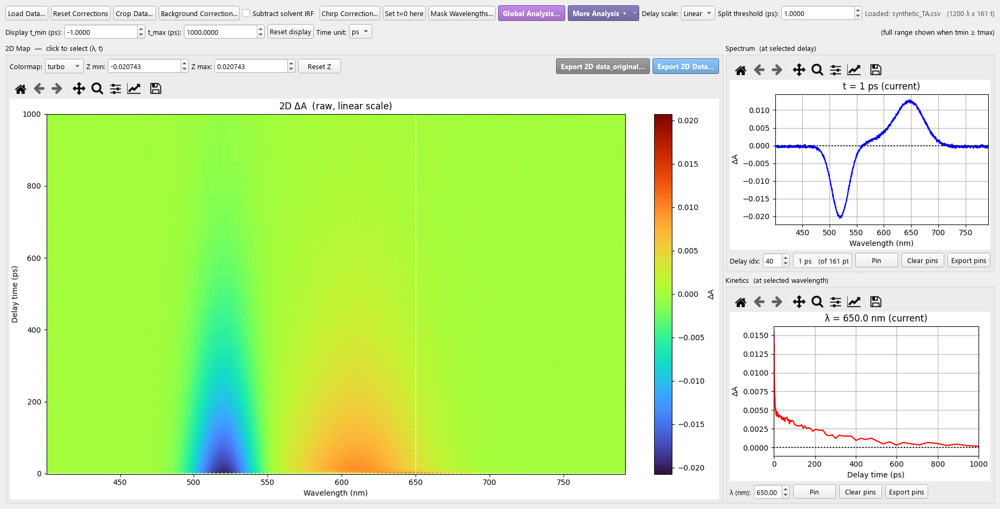
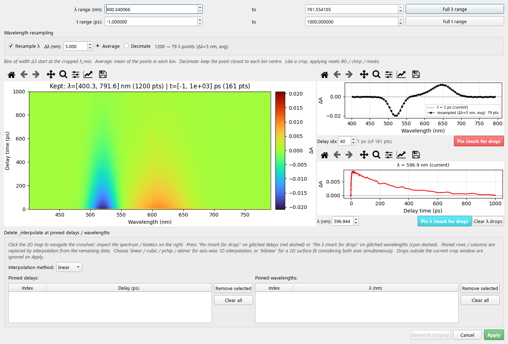

# TA Analyzer — Transient Absorption Data Analyzer

[한국어](README.md) | **English**



## 1. Overview

TA Analyzer is a Windows GUI for loading, correcting, visualizing and analyzing pump-probe transient absorption (TA) data ΔA(λ, t). It is a Python/PyQt5 port of the MATLAB `TRSpecAnalyzer.m`.

Main features:
- **Loading**: auto-detected single files, averaging several files, accumulating repeat scans from a folder, and a Custom loader where you mark the data layout yourself
- **Corrections**: background, chirp (Sellmeier), solvent IRF subtraction, wavelength masks, t=0 shift, crop with **wavelength resampling** (v1.1.0), and removing/interpolating bad delays or wavelengths
- **Analysis**: Global Analysis (DADS/EADS, stretched exponentials), SVD, single-trace kinetic fit, LDA, MCR-ALS, coherence (FFT map, LPSVD)
- **Export**: 2D matrices (CSV/TSV/xlsx), pinned spectra and kinetics, analysis results and residuals

## 2. Versions and downloads

| Version | Tag | Contents |
|---|---|---|
| **v1.1.0** (latest) | [`v1.1.0`](https://github.com/Myungsam/ta_analyzer/releases/tag/v1.1.0) | Wavelength resampling (Average / Decimate) in Crop Data, Korean/English user guide |
| v1.0.0 | [`v1.0.0`](https://github.com/Myungsam/ta_analyzer/releases/tag/v1.0.0) | Version before resampling |

**Executable (no Python needed)**
Download `TA_Analyzer.exe` for the version you want from the [Releases](https://github.com/Myungsam/ta_analyzer/releases) page and run it.

**Source**
```bash
git clone https://github.com/Myungsam/ta_analyzer.git
cd ta_analyzer
git checkout v1.1.0      # latest (same as main)
git checkout v1.0.0      # previous version
```
Without git, use **Source code (zip)** on the Releases page.

## 3. Installation and running

**Executable**: double-click `TA_Analyzer.exe`. It is a single-file executable, so the first start can take a few seconds.

**From Python** (3.10 or newer):
```bash
pip install PyQt5 numpy scipy matplotlib openpyxl
python ta_main.py
```

| Package | Required? | Used for |
|---|---|---|
| PyQt5, numpy, scipy, matplotlib | required | GUI, computation, plots |
| openpyxl | recommended | Excel (.xlsx) export, residual files |
| tensorflow 2.10.x, pynvml | optional | GPU computation and GPU status in Global Analysis |

## 4. Quick start: standard workflow

1. **Load Data...** → choose *Standard* and open a file such as `_TA_spectra_Accumulated.csv`.
2. In **Crop Data...** set the λ/t range and, if you want fewer wavelength points, turn on **Resample λ** (section 5.3).
3. **Background Correction...** subtracts the mean of the first N delays (t < 0).
4. **Chirp Correction...**: click the 2D map or use *Auto-place* to mark t₀(λ), then press **Fit & Apply**.
5. (Optional) **Subtract solvent IRF**, **Mask Wavelengths...**
6. **Global Analysis...**: enter the number of components and initial τ values, press **Run**, and inspect DADS/EADS.
7. Save with **Export 2D Data...** and the Export buttons in each analysis window.

Clicking the 2D map updates the Spectrum (selected t) and Kinetics (selected λ) panels on the right. **Pin** keeps several traces overlaid.

## 5. Feature guide

### 5.1 Loading data
- **Standard**: auto-detects one file. Selecting several files opens *Load & Average*, which averages the checked files.
- **Custom**: in a table preview, drag to mark the X (wavelength), Y (delay) and Z (ΔA) regions. A transposed matrix is flipped automatically.
- **Accumulation**: preview each repeat scan in a folder (`_TA_spectra_Current_Set_*.csv`, …) as a 2D map and average only the clean ones.

### 5.2 Corrections
Corrections never modify the loaded data; they are recomputed in the order **background → chirp → solvent IRF subtraction → masks**. **Reset Corrections** turns them all off (a loaded solvent file is kept).
- **Background**: subtracts the mean spectrum of the first N delays.
- **Chirp**: points (λ, t₀) are fitted with `t₀(λ) = a·√((bλ²−1)/(cλ²−1)) + d` and every wavelength is shifted in time. Points can be saved to and loaded from CSV.
- **Solvent IRF subtraction**: loads a pure-solvent measurement, aligns it to the sample grid and computes `ΔA − s·ΔA_solvent`. Set the scale `s` with the slider or *Auto*.
- **Mask**: sets wavelength ranges to NaN or 0.
- **Set t=0 here**: moves t=0 to the crosshair position.

### 5.3 Crop and wavelength resampling (v1.1.0)



The **Crop Data...** window cuts the λ/t range and can optionally reduce the number of wavelength points.

1. Enter the `λ range` and `t range` (*Full λ range* / *Full t range* select everything).
2. Check **Resample λ** and enter the spacing **Δλ (nm)**.
3. Choose **Average** or **Decimate**.
4. Compare the original (grey line) and the result (black dots and line) in the Spectrum panel, and check the point count shown as, e.g., `1200 → 79 λ points`.
5. Press **Apply**.

**How it works**
- The axis is split into bins of width Δλ starting at the first wavelength λ_min of the cropped range: `[λ_min + kΔλ, λ_min + (k+1)Δλ)`. A point exactly on a boundary goes into the upper bin.
- **Average**: the wavelength and ΔA of all points in a bin are averaged (NaNs are ignored; an all-NaN bin stays NaN). This lowers the noise.
- **Decimate**: only the original point closest to each bin centre is kept; the others are dropped. The values are real measured values, not averages.
- Bins that contain no original point (e.g. masked regions or gaps) are left out.
- Measured wavelength spacing is usually not uniform (e.g. 0.27–0.38 nm), so the resulting wavelengths are only approximately Δλ apart.

**Notes**
- Like a crop, Apply **resets background, chirp, masks, the t=0 shift and Global Analysis results**. Resample first, then apply corrections.
- If Δλ is not larger than the mean wavelength spacing, a warning appears and **only the crop is applied, without resampling**.
- With solvent IRF subtraction, the solvent is reduced with **exactly the same bins** as the sample before it is subtracted.
- Pinning delays/wavelengths for interpolation while resampling is on rebuilds the data from the original, so earlier interpolations that are not pinned again are lost.
- **Revert to Original**, or Full range + unchecked Resample + Apply, returns to the original resolution. The status bar shows the state, e.g. `[resampled Δλ=5 nm, avg]`, and exported file names get `rs5nm` appended.

**Removing and interpolating delays/wavelengths**: mark glitched delays or wavelengths with **Pin (mark for drop)**; they are refilled with linear/cubic/pchip/akima/bilinear interpolation.

### 5.4 Analysis
| Menu | Description |
|---|---|
| **Global Analysis** | Fits a sum of exponentials ⊗ Gaussian IRF to the whole matrix (fixed τ, stretched β, τ=∞ component, fit window). Results: τ, DADS, EADS, fit, residual. GPU selectable when TensorFlow is installed |
| **SVD** | Singular value spectrum, U/V vectors, rank-N reconstruction and residual |
| **Kinetic Fit** | Fits one wavelength (or a wavelength-window average) with multi-exp ⊗ IRF |
| **LDA** | Tikhonov-regularized lifetime density map, L-curve for choosing α |
| **MCR-ALS** | Decomposes into pure spectra S(λ) and concentration profiles C(t) |
| **Coherence** | 2D \|FFT\|² map of the residual (cm⁻¹/THz), LPSVD mode decomposition |

**Save residual** in GA and LDA writes an xlsx to the `residuals/` folder, which the Coherence window can load again.

### 5.5 Export
- **Export 2D Data...**: the corrected matrix. The file name records the state (e.g. `_2D_BG5_chirp_cropped_rs2nm.csv`).
- **Export 2D data_original...**: the matrix before corrections (crop/resampling included)
- **Export pins** in the Spectrum/Kinetics panels and the Export buttons in each analysis window

## 6. Input file formats

CSV / TSV / DAT / TXT are read automatically (delimiter detection, blanks and NaN handled).

**Format A** (first row = delays, first column = wavelengths)
```
corner, t1, t2, ..., tN
λ1,     ΔA, ΔA, ..., ΔA
λ2,     ΔA, ...
```
**Format B** (two metadata columns: `row[0][2:]` = delays, `row[i][1]` = wavelength)

For files that match neither, use **Load Data → Custom** and mark the regions yourself. Exported 2D files use Format A, so they can be loaded again.

## 7. Troubleshooting

| Symptom | Fix |
|---|---|
| The exe starts slowly or antivirus blocks it | The single-file exe unpacks itself on first start. Add an antivirus exception |
| A file cannot be read | Use the Custom loader and mark the X/Y/Z regions |
| BG/chirp disappeared after resampling | Expected (section 5.3). Apply the corrections again after resampling |
| "Δλ must be larger..." warning | Enter a Δλ larger than the mean wavelength spacing |
| Global Analysis does not converge | Change the initial τ values or fix the IRF t₀/FWHM |
| Restore a zoomed plot | Toolbar Home button, or right-click the panel → Auto scale |

## 8. Developer information

- Architecture: [ARCHITECTURE.md](ARCHITECTURE.md) (Korean) · detailed manuals: [`manual/`](manual/) (Korean/English, md and pdf)
- Tests: run each `test/test_*.py` directly (no pytest needed).
  ```bash
  # Git Bash, from the project root
  export PYTHONPATH=. PYTHONIOENCODING=utf-8 QT_QPA_PLATFORM=offscreen
  python test/test_crop_resample.py
  ```
  Four tests with hard-coded measurement-data paths (`test_real_file`, `test_session_fixes`, `test_crop_input_fix`, `test_crop_preview_perf`) cannot run without that data. The zoom check in `test_new_features` is a known failure since v1.0.0.
- Build: `python -m PyInstaller ta_analyzer.spec --noconfirm --clean` → `dist/TA_Analyzer.exe`
- Regenerate the README images: `python tools/make_screenshots.py` (synthetic data)
- Measurement data (`Data/`), test data folders and build outputs are not part of the repository.

## 9. Changelog

**v1.1.0** (2026-09-28)
- Wavelength resampling in Crop Data: Δλ (nm), Average (bin mean) / Decimate (point closest to the bin centre)
- Resampling preview and point count in the Crop window's Spectrum panel
- Solvent IRF subtraction uses the same bins as the sample
- Fixed the outermost wavelength being cut off by spinbox rounding
- Korean/English user guide (README.md, README_EN.md) with screenshots

**v1.0.0**
- Baseline before resampling: three loaders, BG/chirp/solvent IRF/mask corrections, crop with interpolation, Global Analysis, SVD, kinetic fit, LDA, MCR-ALS, coherence
